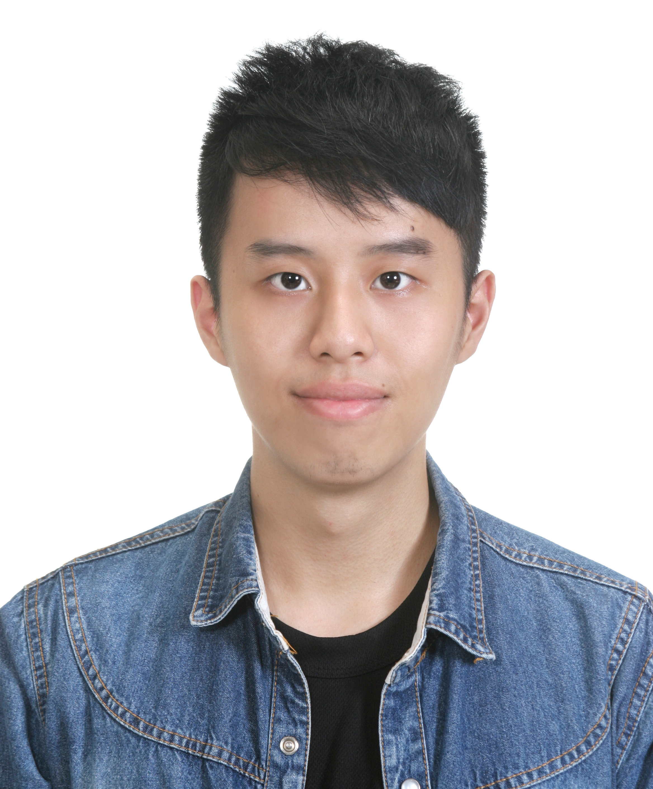

# 			個人簡歷




## 基本資料

```

姓名：廖育承

性別：男

居住地：新北市

生日：1993-10-28

電話：0921249855

方便聯絡時間：9:00 - 18:00

連絡信箱：ramonliao.yc@gmail.com

```


## 自傳

```

主修土木工程、副修電機工程，在服兵役的一年裏，完成了自己設定的目標。除了考取雅思的英文檢定，也習得了深度學習及Tensorflow，並利用時間鍛鍊身體，讓心理和生理都保持在良好的狀態。

以前我曾在求學時上過基礎的程設課程，其他大部分都是看書自學，因此讓我學會在發現問題時，可以自己上Google、StackOverflow等網站尋找答案，進而解決問題。若發現解決方式太多、資訊爆炸，我也會透過整合和比較來找出最適合自己的解決方式。

因為有著土木和電機的背景，讓我看待事情的角度更加不一樣。之前在兼職和大學舉辦營隊時，也曾面對過人力不足的難題。當下在分析過各部門的條件和情況後，我快速和其他部門負責人商量人力的借用，並調動人力解決問題，也在問題解決後的第一時間將人力復原。

除了專心做好自己的工作，我也保持著對知識的渴望，會透過不斷的閱讀來充實自己。有時候也會有些天馬行空的點子，就會動手實作來完成它。前陣子我就很好奇股價的走向，想寫一支預測股價的程式，便寫爬蟲到台灣證券交易所擷取交易資料並存進資料庫，之後再進行運算和預測。目前已完成第一階段，第二三階段仍在開發中。

未來，預計在三年內達到自己心目中的水平，並多方參與黑客松競賽，增加自己實務經驗與應用。也規劃在2019年下旬，考取研究所在職進修，以補足電腦科學的基礎知識。

```


## 專業技能

* C 語言

* Python 應用

* SQLite
* 網頁爬蟲
* 深度學習


## 作品集與相關連結

* 基因演算法
* 股價爬蟲


## 教育背景

##### 國立中興大學,  學士

* 主修,  土木工程學系

  > 2012 年 9 月 - 2017 年 6 月

* 副修,  電機工程學系

  > 2015 年 9 月 - 2017 年 6 月


## 工作經歷

* TGI FRIDAYS 星期五餐廳 ,  外場服務生

  善於觀察人、團隊溝通與合作，面對各式問題能迅速反應及解決。有調酒經驗。

  > 2016 年 3 月 - 2017 年 11 月


## 資格認證

- #### Emergency Medical Technician 1

  ##### 社團法人中華緊急救護員技術協會

  > 2017 年 12 月 – 2020 年 12 月


## 語言能力

* 英文

  > IELTS 檢定 6.5 級分

* 西班牙文

  > SFLPT 檢定達 A2 等級


## 參與組織

| 名稱                     | 職稱           | 日期                        |
| :----------------------- | :------------- | :-------------------------- |
| 國立中興大學校桌球代表隊 | 隊員           | 2012 年 9 月 – 2017 年 2 月 |
| 第二屆國際領航營         | 器材長         | 2013 年 7 月 – 2013 年 8 月 |
| 國際領航社               | 器材長         | 2013 年 7 月 – 2014 年 6 月 |
| 第三屆國際領航營         | 第三梯次負責人 | 2014 年 7 月 – 2014 年 8 月 |
| TEDxNCHU                 | 社員           | 2015 年 3 月 – 2016 年 2 月 |


## 興趣

* 桌球
* 慢跑
* 健身
* 寫作


## 個人網站

* [LinkedIn](www.linkedin.com/in/ramonliao)
* [GitHub](https://github.com/RamonLiao)
* [Facebook](https://www.facebook.com/yc52811)

